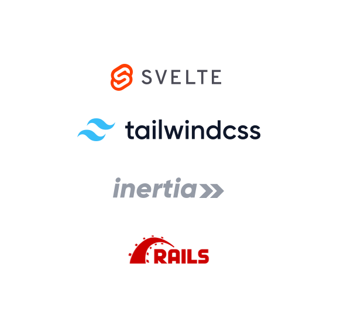

#  How I Learned to Stop Worrying &... <br> Love the _STIR stack_?
Full Stack DFW
2022.02.09

Chris Reed 
[@seereadnow](https:///twitter.com/seereadnow)

---

# But first – clone the repo here: 
## <https://github.com/superbasicxyz/stirstack>

---

# 😬 Wait – why worry?

---


---


# From one size fits all HTML...
## ...to Sessions/JQuery
## ...to Polyfills/JSONP/Turbolinks 
## ...to API/JWT
## ...to React/Microservices/BFF
## ...to Liveview/StimulusReflex

c.f. [Contemporary Front-end Architectures: How we got here](https://blog.webf.zone/contemporary-front-end-architectures-fb5b500b0231)

---


---

>  None of these solutions are silver bullets: I’ve worked with overly-strict REST APIs, optimization-hungry GraphQL APIs, and hand-crafted SQL APIs. But no option really lets a web app be careless about its data-fetching layer. Web applications can’t sit on top of independently-designed APIs: to have a chance at performance, **the application and its datasource need to be designed as one**.
> 
>-[Tom MacWright: SPA Fatigue](https://macwright.com/2020/05/10/spa-fatigue.html)

---

# Prior art 

- [Phoenix LiveView](https://hexdocs.pm/phoenix_live_view/Phoenix.LiveView.html)
- [Rails Hotwire](https://hotwired.dev/)
- [Laravel Livewire](https://laravel-livewire.com/)
- [Django Unicorn](https://www.django-unicorn.com/)
- Alternatively – [Next.js](https://nextjs.org/), [MobX](https://mobx.js.org/react-integration.html), [Remix](https://remix.run/), and [SvelteKit](https://kit.svelte.dev/)

---


---

# More generally

> The hardest part of the software task is arriving at a complete and consistent specification, and much of the essence of building a program is in fact the debugging of the specification. ...
>
>–[Fred Brooks: No Silver Bullet](https://web.archive.org/web/20160910002130/http://worrydream.com/refs/Brooks-NoSilverBullet.pdf)

---

# How do we build better?
## 👋 from "Hello World"... 
## 🏁 ...to MVP 
## 🚀  ...to Go-to-Market 
## 🎰 ...to Scale

\* w/ a small team for a SaaS product needing back-end services

---


---

# ✊ Well, we want...
## 😁 UX: User Experience
## 👾 DX: Developer Experience
## 💰 BV: Business Value

---
# As developers, we want...

- Reasonable abstractions
- Powerful languages
- Minimize artificial cognitive load
- Community support
- Runway


---

## and less...
- Boilerplate
- Bloated syntax
- 🤯 routing and state side effects
- Cowboy imperative crap


---

## As users we want...
- Action
- Safety
- Reactivity (c.f. Don Norman and Jakob Nielson)
- Consistency


---

## and less...
- Redirection after flash of unauth
- Failed actions
- Wasted time


---

## As businesses we want...
- Fast onboarding
- More meaningful functionality
- Fast change


---

## and less...
- Dev pain/desertion
- Horizontal teams
- Bugs 


---


---


# Who am I?
I'm Chris Reed, a principal at [Super Basic](https://www.superbasic.xyz) and you can reach me [@seereadnow](https://twitter.com/seereadnow).

- 10 years in dev, 100+ projects
- Full stack in agencyland
- Clients like Vice, GS, the UN, SMB, start ups
- Consulting, Ops, UX, Data Viz

---


# 🧐 What is the STIR stack?
- Svelte.js
- Tailwind.css
- Inertia.js
- Ruby on Rails




---

# STIR stack
## brings the Rails MVC stack and community into 2022 with concise forward looking components and a simple client/server protocol

---

# [Svelte.js](https://svelte.dev/)?

Let's you build reusable, best practice UI with minimal boilerplate and awesome performance.

- A _component_ framework — like React or Vue 
- "a language for describing reactive user interfaces"
- shifts work from run time to build time "converting your components into highly efficient imperative code that **surgically** updates the DOM"
- built-in accessibility and animations
- [❤️ by devs as per SO](https://insights.stackoverflow.com/survey/2021#section-most-loved-dreaded-and-wanted-web-frameworks)
### 🙇‍♂️ Rich Harris, [@Rich_Harris](https://twitter.com/Rich_Harris), ex-NYT, now Vercel
### c.f. 📖 [What is Svelte?](https://gist.github.com/Rich-Harris/0f910048478c2a6505d1c32185b61934) 

---

# Svelte Example: [Reactive Assignment](https://svelte.dev/examples/reactive-assignments)

```html
<script>
	let count = 0;

	function handleClick() {
		count += 1;
	}
</script>

<button on:click={handleClick}>
	Clicked {count} {count === 1 ? 'time' : 'times'}
</button>
```

---

# [Tailwind.css](https://tailwindcss.com/)
Reduces artificial complexity of CSS by using utility classes with reasonable assumptions rather than adding complexity with semantic, BEM, etc.

> A utility-first CSS framework packed with classes like flex, pt-4, text-center and rotate-90 that can be composed to build any design, directly in your markup.


### 🙇‍♂️ Adam Wathan, [@adamwathan](https://twitter.com/adamwathan), [Tailwind UI](https://tailwindui.com/), [Full Stack Radio](https://fullstackradio.com/)

### c.f. 📖 [CSS Utility Classes and "Separation of Concerns"](https://adamwathan.me/css-utility-classes-and-separation-of-concerns/)

---
# Tailwind example:

```html
<div class="p-6 max-w-sm mx-auto bg-white rounded-xl shadow-lg flex items-center space-x-4">
  <div class="shrink-0">
    
  </div>
  <div>
    <div class="text-xl font-medium text-black">ChitChat</div>
    <p class="text-slate-500">You have a new message!</p>
  </div>
</div>
```

---

# [Inertia.js](https://inertiajs.com/)
Simplifies the contract between server and client

> ...a client-side routing library

- HTTP then XHR protocol for client/server response/request
- ~ SPA w/o extra complexity of sprawling interface for API & client side state management

### 🙇‍♂️ Jonathan Reinink, [@reinink](https://twitter.com/reinink)

### 📖 c.f. [Server Side Apps with Client Side Rendering](https://reinink.ca/articles/server-side-apps-with-client-side-rendering)

---

# Inertia.js example in Svelte:

```html
<script>
  import { Inertia } from '@inertiajs/inertia'

  let values = {
    email: null,
  }

  function handleSubmit() {
    Inertia.post('/users', values)
  }
</script>

<form on:submit|preventDefault={handleSubmit}>
  <label for="email">Email:</label>
  <input id="email" bind:value={values.email}>

  <button type="submit">Submit</button>
</form>

<a href="/" use:inertia>Home</a>
  
```
---

# [Ruby on Rails](https://rubyonrails.org/)

Server side MVC framework with lots of convention over configuration

- Use HTTP
- Forms “just work” and are connected to your DB via modes which are all generated via a CLI. Validations just work. Lean on the ORM.
- Security comes “for free” with built in CSRF.
- Components previously built with partials. 

### 🙇‍♂️ to David Heinemeier Hansson, [@dhh](https://twitter.com/dhh)

### 📖 c.f. [Rails Doctrine](https://rubyonrails.org/doctrine)

---

# Rails example

```ruby
class Project < ApplicationRecord
  belongs_to :account
  has_many :participants, class_name: 'Person'
  validates_presence_of :name
end
```


---

# So what does this look like?
## ALL KILLER – NO FILLER

- HTTP first, then XHR (Inertia)
- Form helpers with and controller tweaks for Inertia
- Validation through Rails-Inertia-Svelte
- Client-side interative UI components incl. animations + accessibilty via Svelte
- ... with readable in-line classes, packaged as needed via Tailwind/Webpacker
- Model, ORM, Routing via Rails

---

# To preview
- Form Validation
- Layouts and Modal 
- Optimistic UI Example TODO

---

# Q & A

---


---

# Really dig it? 
- Let me know how to improve the talk!
- [Contribute to the repo](https://github.com/superbasicxyz/stirstack)
- Tweet your experience w/ #STIRstack

- Ask a friend to check out [fullstackdfw.com](https://www.fullstackdfw.com)

---

# Later for the STIRstack 1/2
- Demo or starter template?
- Maintain repo?
- Heroku Deploy?
- Websockets?
- Dig in on the tech talk (abstraction weight, benefits)

---

# Later for the STIRstack 2/2
- [Inertia Svelte SSR](https://inertiajs.com/server-side-rendering)
- [Inertia Rails SSR](https://github.com/inertiajs/inertia-rails/pull/73)
- [Typescript](https://storck.io/posts/adding-typescript-to-svelte-with-webpacker/)
- [Tailwind 3.0 Upgrade](https://tailwindcss.com/blog/tailwindcss-v3) and [Rails 7 Upgrade](https://rubyonrails.org/2021/12/15/Rails-7-fulfilling-a-vision)
- [Railway Oriented Programming](https://fsharpforfunandprofit.com/rop/) with [Dry Monads](https://hanamimastery.com/episodes/7-untangle-your-app-with-dry-monads) 

---

# Thanks
## [@christoomey](https://twitter.com/christoomey?lang=en) and [bikeshed.fm](https://bikeshed.fm/)
- [@willsommers](https://github.com/Will-Sommers)
- [@_jameswpierce](https://twitter.com/_jameswpierce)


---

# and here are some follow ups

- [Learn more Svelte here](https://svelte.dev/examples/hello-world) and [see it in action](https://madewithsvelte.com/)
- [Learn more Tailwind](https://github.com/aniftyco/awesome-tailwindcss)
- [See more Inertia](https://builtwithinertia.com/)
- [See more Rails](https://prograils.com/top-10-famous-sites-built-with-ruby-on-rails)
- Find and support some under represented groups
  - [WnbRb](https://twitter.com/wnb_rb)
  - [SvelteSirens](https://twitter.com/SvelteSirens)
